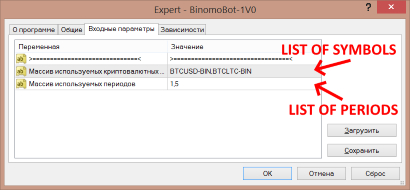

# binomo-bot
Бот для торговли у брокера https://binomo.com/

## Возможности бота

* Бот представляет из себя "мост" между MT4 и брокером **binomo**. На данный момент бот может поставлять поток котировок в МТ4 для любых символов и периодов в виде автономного графка.

* Список доступых валютных пар:

```
ZCRYIDX		
AUDNZD		
GBPNZD		
EURNZD		
EURMXN		
EURIDX		
JPYIDX		
EURUSD		
CRYIDX		
BTCLTC		
AUDUSD		
AUDCAD		
EURJPY		
AUDJPY		
USDJPY	
USDCAD	
EURCAD(OTC)	
NZDUSD		
GBPUSD	
XAUUSD
USDJPY(OTC)	
GBPUSD(OTC)	
EURUSD(OTC)	
USDCHF	
AUDCAD(OTC)	
BTCUSD	
GBPJPY(OTC)	
CHFJPY	
NZDJPY	
```

**Внимание! МТ4 не поддерживает графики с количеством знаков после запятой больше 6-ти, поэтому бот автоматически уменьшает точность котировок до 6 знаков.**

## Установка бота

### Настройка бота

Бот в момент запуска ищет файл **config.json**, который расположен в папке с программой. Файл **config.json** содержит [json структуру](https://json.org/json-ru.html), которая определяет настройки бота.


Настройки бота в файле **config.json** выглядят примерно так:

```json
{
	"named_pipe": "binomo_api_bot",
	"symbol_hst_suffix":"-BIN",
	"sert_file": "curl-ca-bundle.crt",
	"cookie_file": "binomo.cookie",
	"volume_mode":2,
	"candles": 14400,
	"path": "C:\\Users\\user\\AppData\\Roaming\\MetaQuotes\\Terminal\\2E8DC23981084565FA3E19C061F586B2\\history\\RoboForex-Demo",
	"symbols": [
		{
			"symbol":"ZCRYIDX",
			"period":60
		},
		{
			"symbol":"BTCUSD",
			"period":60
		},
		{
			"symbol":"BTCLTC",
			"period":60
		},
		{
			"symbol":"AUDNZD",
			"period":60
		},
		{
			"symbol":"GBPNZD",
			"period":60
		},
		{
			"symbol":"EURNZD",
			"period":60
		}
	]
}
```
* named_pipe - Имя именованного канала. Данный канал нужен для связи между ботом и советником в МТ4. **В текущей реализации параметр не задействован.**
* symbol_hst_suffix - Суффикс для имен файлов котировок для МТ4. Нужен, чтобы файлы котировок binomo можно было отличить от других котировок. Имя файла формруется так: имя символа + суффикс. Например: 'BTCUSD' + '-BIN' = 'BTCUSD-BIN'
* sert_file - Имя файла сертификата для работы с HTTPS. Можно оставить без изменений.
* cookie_file - Имя файла куков. Можно оставить без изменений.
* volume_mode - Режим работы с объемом. 0 - без тикового объема, 1 - расчет тикового объема как количество тиков, 2 - расчет тикового объема как взвешенный подсчет тиков.
* candles - Количество баров исторических данных.
* path - Путь к папке, где МТ4 хранит файлы котировок. Обычно это папка <католог данных>\history\<имя сервера брокера>. Каталог данных можно открыть из МТ4, нажав "Файл->Открыть каталог данных".   
* symbols - Массив потоков котировок. Данный параметр нужен для настройки подписки бота на поток котировок. Каждый элемент массива содержит два параметра: symbol и period, где первый параметр - *имя символа*, а второй параметр - период баров *в секундах* (60 - это 1 минута).

После того, как настройки в файле **config.json** заданы верно, можно запустить программу. Из настроек в данный момент интерес представляет добавление/удаление графиков валютных пар с заданным периодом.

После запуска, программа будет автоматически обновлять файлы котировок автоновмынх графикв в МТ4.

### Настройки советника МТ4

Советник **BinomoBot-1V0** для своей работы требует разрешения на использование *dll библиотек*. 


В параметрах совтеника нужно перечислить список использумых ботом валютных пар, например *BTCUSD-BIN,BTCLTC-BIN*, а также указать все используемые периоды, например *1,5* для таймфреймов 1 и 5 минут.



